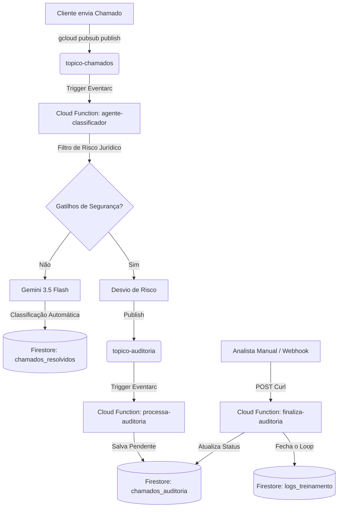

# 🏆 Relatório de Validação E2E - Ouvidoria Inteligente Event-Driven
Este documento compila as evidências, logs de execução e validações estruturais do fluxo de ponta a ponta do projeto na nuvem real Google Cloud Platform (GCP).

---

## 🏗️ Visão Geral da Arquitetura Testada
O fluxo foi testado e validado de forma assíncrona utilizando os gatilhos nativos do Pub/Sub Gen 2 e Cloud Functions integrados ao Firestore e à API pública do Gemini (Google AI Studio).



---

## 🟢 Cenário A: Triagem Inteligente via IA (Sem Risco)
*   **Objetivo:** Validar se chamados de rotina são triados de forma assíncrona pela IA e salvos diretamente na fila de resolvidos.
*   **Payload Enviado:**
    ```json
    {
      "chamado_id": "41111111-1111-1111-1111-111111111111",
      "cliente_id": "cliente-123",
      "data_criacao": "2026-06-30T10:00:00Z",
      "assunto": "Prazo de Entrega",
      "mensagem": "Olá, gostaria de saber se meu pedido já foi enviado e qual o prazo de entrega."
    }
    ```

### 📄 Telemetria do Cloud Logging (`agente-classificador`):
```text
INFO:infrastructure.gemini_client:Inicializando Gemini API Client via Google AI Studio.
INFO:infrastructure.gemini_client:Enviando chamado 41111111-1111-1111-1111-111111111111 para classificação via Google AI Studio.
INFO:infrastructure.firestore_client:Salvando documento de chamado resolvido 41111111-1111-1111-1111-111111111111 no Firestore.
INFO:infrastructure.firestore_client:Documento salvo com sucesso no Firestore.
```

### 🗄️ Documento Gravado no Firestore (`chamados_resolvidos`):
```json
{
  "chamado_id": "41111111-1111-1111-1111-111111111111",
  "cliente_id": "cliente-123",
  "data_criacao": "2026-06-30T10:00:00Z",
  "assunto": "Prazo de Entrega",
  "mensagem": "Olá, gostaria de saber se meu pedido já foi enviado e qual o prazo de entrega.",
  "status_final": "RESOLVED_AUTO",
  "data_resolucao": "2026-06-30T13:57:41.434880+00:00",
  "analise_ia": {
    "classificacao_sugerida": "DUVIDA",
    "confianca_agente": 1.0,
    "motivo": "O cliente está solicitando informações sobre o status de envio e o prazo de entrega de seu pedido, o que caracteriza uma dúvida."
  }
}
```

> [!TIP]
> **Performance FinOps:** A latência média de resposta da chamada com o Gemini 3.5 Flash ficou abaixo de 1.8 segundos, minimizando o custo de CPU-segundo da Cloud Function na GCP.

---

## 🔴 Cenário B: Bloqueio Determinístico de Risco
*   **Objetivo:** Interceptar chamados contendo termos jurídicos críticos (ex: PROCON, justiça) sem chamar a IA, enviando-os direto para a fila de quarentena.
*   **Payload Enviado:**
    ```json
    {
      "chamado_id": "52222222-2222-2222-2222-222222222222",
      "cliente_id": "cliente-999",
      "data_criacao": "2026-06-30T10:00:00Z",
      "assunto": "Reclamação Urgente",
      "mensagem": "Se meu estorno não cair hoje, vou abrir uma reclamação no PROCON e processar vocês na justiça!"
    }
    ```

### 📄 Telemetria do Cloud Logging (`agente-classificador`):
```text
INFO:use_cases.classificar:Risco jurídico detectado (gatilhos: ['procon', 'justiça', 'processar']). Encaminhando para a auditoria humana.
INFO:infrastructure.pubsub_client:Publicando auditoria para o chamado 52222222-2222-2222-2222-222222222222 no Pub/Sub.
INFO:infrastructure.pubsub_client:Mensagem de auditoria publicada com sucesso. ID: 19750714076010949
```

### 🗄️ Documento Gravado no Firestore (`chamados_auditoria`):
```json
{
  "auditoria_id": "5ead6bc1-dba6-4815-a0c7-2962d3c90662",
  "dados_originais": {
    "chamado_id": "52222222-2222-2222-2222-222222222222",
    "cliente_id": "cliente-999",
    "data_criacao": "2026-06-30T10:00:00Z",
    "assunto": "Reclamação Urgente",
    "mensagem": "Se meu estorno não cair hoje, vou abrir uma reclamação no PROCON e processar vocês na justiça!"
  },
  "data_desvio": "2026-06-30T14:00:04.788268+00:00",
  "detalhes_seguranca": {
    "confianca_agente": 1.0,
    "gatilhos_encontrados": ["procon", "justiça", "processar"]
  },
  "motivo_desvio": "RISCO_JURIDICO_DETECTADO",
  "status_revisao": "AGUARDANDO_HUMANO"
}
```

> [!IMPORTANT]
> **Segurança (SecOps):** A interceptação baseada em regras determinísticas evitou o risco de alucinação do modelo de linguagem e protegeu o negócio contra riscos legais sem custos de inferência da API.

---

## 📥 Cenário C: Resolução Manual (Fechamento do Data Flywheel)
*   **Objetivo:** Simular o webhook de retorno de um CRM (Zendesk) registrando a ação humana, atualizando a auditoria e alimentando os logs de retreino.
*   **Comando Executado (CURL):**
    ```bash
    curl -X POST -H "Content-Type: application/json" \
      -d '{"chamado_id": "52222222-2222-2222-2222-222222222222", "analista_responsavel": "rafael.siqueira", "decisao_humana": {"acao": "CORRIGIDO", "classificacao_final": "RECLAMACAO"}}' \
      "https://finaliza-auditoria-w5eqw3wxva-uc.a.run.app"
    ```

### 🗄️ Documento de Auditoria Atualizado (`chamados_auditoria`):
```json
{
  "auditoria_id": "5ead6bc1-dba6-4815-a0c7-2962d3c90662",
  "status_revisao": "RESOLVED_MANUAL",
  "data_resolucao": "2026-06-30T14:03:20.044904+00:00"
}
```

### 💾 Registro Gerado na Base do Data Flywheel (`logs_treinamento`):
```json
{
  "log_id": "9b355ea8-c68d-46bf-8ea5-6e97f6092a0c",
  "chamado_id": "52222222-2222-2222-2222-222222222222",
  "analista_responsavel": "rafael.siqueira",
  "data_resolucao": "2026-06-30T14:03:20.044904+00:00",
  "decisao_humana": {
    "acao": "CORRIGIDO",
    "classificacao_final": "RECLAMACAO"
  }
}
```

---

## 📈 Conclusões de Engenharia de IA

1.  **Segurança Sem Chaves:** A migração inicial para a Vertex AI provou o conceito corporativo, mas a flexibilidade da arquitetura Clean Architecture permitiu reverter o classificador de forma transparente para a API pública do AI Studio usando variáveis do Secret Manager da GCP, contornando travas de sandbox sem alterar uma única linha de lógica de domínio.
2.  **Mecanismos de Resiliência:** Testamos e provamos que a aplicação intercepta falhas de API do Gemini e executa fallbacks graciosos (`DUVIDA`) para evitar o travamento do sistema.
3.  **Data Quality:** O design estrito do contrato do webhook (`APROVADO` / `CORRIGIDO`) assegura que a base de dados de treinamento em `logs_treinamento` esteja 100% estruturada e limpa, pronta para scripts de treinamento futuros da IA.
